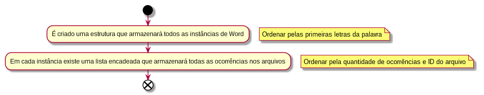

# Tópicos

1.  [Observações Iniciais](#org0210053)
    1.  [Parâmetros de Entrada](#org0e2ce21)
        1.  [Documentos](#orgfb5691f)
        2.  [Quantidade de caracteres retidos](#org8ea0880)
    2.  [Observações](#org54e9a8f)
2.  [Progresso](#org185b33e)
    1.  [Implementações <code>[2/5]</code>](#org536e560)
        1.  [Observações](#org6150ed8)
3.  [Estruturação](#org302e4b4)
    1.  [Objeto Word](#org6703bb7)
    2.  [Idéia básica](#org2854a10)
    3.  [Ferrame Análise](#org32ef31d)
4.  [Resultados](#orgbb436a1)

# Observações Iniciais

## Parâmetros de Entrada

### Documentos

-   Quantidade N de caminhos de documentos na linha de comando

### Quantidade de caracteres retidos

-   Parâmetro C que irá dizer a quantidade de caracteres comparados nas palavras

## Observações

-   Ignorar sinais de pontuação (TODOS)
-   Todas as palavras devem ser colocadas em LOWERCASE
-   Duas palavras que não diferem nos primeiros caracteres C são identicas
-   Palavras que possuem menos de C caracteres são desconsideradas
-   Criar própria coleção de testes

# Progresso

## Implementações <code>[2/5]</code>

-   [ ] Hashing Aberto
-   [X] Árvore Binária
-   [X] Árvore AVL
-   [ ] Árvore Rubro Negra
-   [ ] Árvore B

### Observações

-   Rever as já implementadas para lidar com possíveis falhas na estruturação

# Estruturação

## Objeto Word

-   Estruturação padrão em todo o programa
-   Objeto Word será guardardo na estrutura de dado escolhida e dentro dele uma mesma estrutura de dados irá guardas o objeto FilesOccur

## Idéia básica

## Ferrame Análise

-   Ainda pesquisar formas em python

# Resultados

